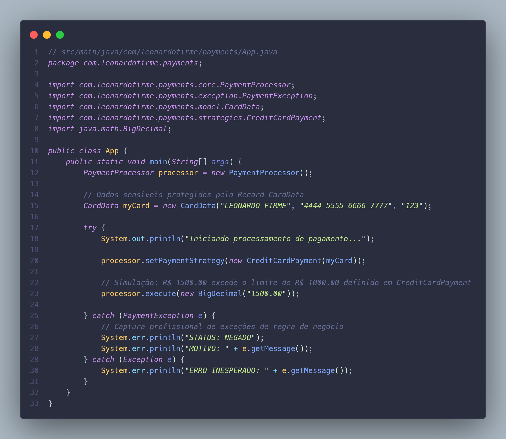

# Payment Engine - Java Strategy Pattern

[](https://openjdk.org/projects/jdk/21/)
[](https://maven.apache.org/)
[](LICENSE)



Um motor de processamento de pagamentos modular desenvolvido em **Java 21 puro**, focado na demonstração de padrões de projeto (Design Patterns) e princípios **SOLID**.

## 🛠️ Tecnologias e Conceitos

- **Linguagem:** Java 21 (LTS).
- **Gerenciador de Build:** Maven.
- **Design Pattern:** Strategy (para desacoplamento de métodos de pagamento).
- **Java Records:** Utilizados para imutabilidade de DTOs (Data Transfer Objects).
- **Custom Exceptions:** Hierarquia de exceções para tratamento de erros de regra de negócio.
- **Princípios SOLID:** Foco especial em OCP (Open/Closed Principle) e DIP (Dependency Inversion Principle).


## 🏗️ Arquitetura do Projeto

O projeto utiliza o padrão **Strategy** para permitir que novos métodos de pagamento (Pix, Boleto, Cripto) sejam adicionados sem a necessidade de alterar o código central do processador (`PaymentProcessor`).

### Estrutura de Pastas
```text
src/main/java/com/leonardofirme/payments/
├── core/           # Motor de execução (Contexto)
├── exception/      # Exceções personalizadas de domínio
├── model/          # Modelos de dados imutáveis (Records)
└── strategies/     # Contratos e implementações de pagamento
```

---

### 📫 Vamos construir algo grande?

[](https://www.linkedin.com/in/leonardofirme)
[](https://www.npmjs.com/~leonardofirme)
[](https://github.com/LeonardoFirme)

---

Desenvolvido por **[Leonardo Firme](https://github.com/LeonardoFirme)**